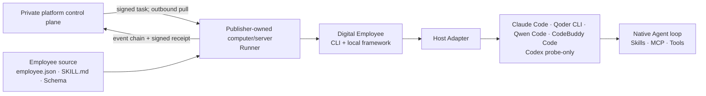
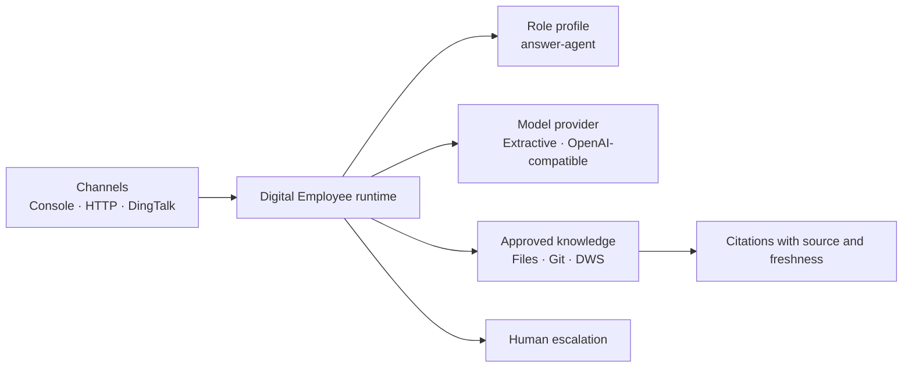

# Digital Employee: Agent-native employee CLI and outer runtime

[简体中文](README.zh-CN.md)

**Product direction:** [Strategy](docs/strategy.md) · [Roadmap](docs/roadmap.md)

Digital Employee is an open CLI, package contract and local execution framework
for portable digital employees. Claude Code, Qoder CLI, Codex or another
capable Agent Host owns the model, context and native tool loop. The framework
owns host adapters, policy, package integrity, normalized events and the Runner
execution boundary.

The current source delivers the CLI, portable employee package, model-free
preflight, four version-gated one-shot adapters, and a V0.3 Runner preview:
platform-signed tasks, deterministic package digests, sealed local snapshots,
lease fencing, hash-chained events and Runner-signed receipts. A deployable,
seller-owned `runner start` process, durable local replay/outbox and reconnecting
outbound client are not shipped yet; they belong to this open framework's
roadmap. Server-side device registration, task dispatch and usage/settlement
services belong to the private platform.

`answer-agent` is the historical first employee use case: a read-only team
support employee that answers with citations, refuses unsupported claims and
escalates uncertainty to a human. Its checked-in implementation belongs to the
`standalone-v1` compatibility path. The Agent-native builder now ships the
versioned `minimal-answer.v1` and `structured-action.v1` public recipes.



## Source-tree workflow

The current source provides package scaffolding, static validation, offline
fixture conformance and local host diagnosis. None of these commands starts a
model run:

```bash
npm ci
npm run build
node ./dist/apps/cli/bin.js doctor
node ./dist/apps/cli/bin.js init ../team-answer \
  --recipe minimal-answer.v1 \
  --author your-team
node ./dist/apps/cli/bin.js validate ../team-answer
node ./dist/apps/cli/bin.js eval ../team-answer --json
node ./dist/apps/cli/bin.js doctor --engine qoder
node ./dist/apps/cli/bin.js doctor --engine claude-code
node ./dist/apps/cli/bin.js doctor --engine qwen-code
node ./dist/apps/cli/bin.js doctor --engine codebuddy
```

`init --recipe` accepts exactly `minimal-answer.v1` or
`structured-action.v1`; omitting it defaults to `minimal-answer.v1`. The
contract eval reads the declared `./evals/cases.json` with exact top-level
`{schemaVersion,cases}` and case `{id,input,expectedOutput}` shapes, then checks
the fixtures against the package Schemas. `--json` emits
`employee-eval-result.v1alpha1` with status, machine code, optional employee
identity, summary and ordered case results. A pass exits `0`; any package,
contract or fixture failure exits `1`. It never invokes a model, Agent Host,
MCP or online service.

See the [portable employee package](docs/employee-package.md) and the
[Agent-host boundary ADR](docs/decisions/0001-agent-host-boundary.md). The
[Agent Host support policy](docs/agent-hosts.md) records the exact status.
Qoder CLI 1.1.x, Claude Code `>=2.1.214 <2.2.0`, Qwen Code `0.17.1` and
CodeBuddy Code `2.106.4` have runnable source adapters. Codex remains
probe-only: Codex CLI 0.146.0 cannot reliably remove every model-visible
built-in tool, notably `apply_patch`, so it cannot satisfy the default-deny
tool contract.

| Runnable engine | Conformance gate | Required deployment settings |
| --- | --- | --- |
| `qoder` | Qoder CLI 1.1.x | `QODER_PERSONAL_ACCESS_TOKEN` |
| `claude-code` | Claude Code `>=2.1.214 <2.2.0` | `ANTHROPIC_API_KEY` |
| `qwen-code` | Qwen Code `0.17.1` | `OPENAI_API_KEY`, `OPENAI_MODEL` |
| `codebuddy` | CodeBuddy Code `2.106.4` | `CODEBUDDY_API_KEY`, `CODEBUDDY_MODEL` |

## Runner on a publisher-owned machine

Every application/service employee runs on the publisher or operator's own
computer or server. The private platform stores listing identity, package
digest, Quote, lease, events and settlement records. It never stores a local
package path, employee package contents or Agent Host credentials, and it never
dials into the operator machine.

V0.3 provides an embeddable one-shot Runner executor and a signed-renewal lease
state machine. A long-running Runner must use outbound calls only: claim a
task, accept a platform-signed lease, resolve the employee package by identity
on the local machine, invoke a local Agent Host, and upload hash-chained events
plus a signed receipt. A separate platform `UsageVerifier` must approve
billable facts; Runner-attested tokens never debit Credits directly.

See the [Runner integration path](docs/runner.md) and [ADR 0002](docs/decisions/0002-runner-execution-boundary.md).
There is no claim that a deployable `runner start` network daemon exists yet;
the seller-owned daemon, durable local replay/outbox, reconnect and outbound
platform client remain open-framework work. Server-side device registration,
task dispatch, `UsageVerifier`, Quote, Credit and settlement APIs remain private
platform work.

Every runnable adapter is stateless and one-shot. It requires an explicit
deployment service credential and never reuses a personal CLI login. Unlike
the commands above, `run` starts a real Agent/model run and may consume the
selected provider's credits. For example, the Qoder path is:

```bash
export QODER_PERSONAL_ACCESS_TOKEN='...'
node ./dist/apps/cli/bin.js validate ../team-answer --engine qoder
printf '%s\n' '{"message":"What does the approved handbook say?"}' | \
  node ./dist/apps/cli/bin.js run ../team-answer --engine qoder --stdin
```

Select `claude-code`, `qwen-code` or `codebuddy` in the same commands after
configuring that adapter's service API key. `--stdin`/`--input-file` keep task
data out of the outer process arguments. Claude Code, Qwen Code and CodeBuddy
receive only a sealed, bounded UTF-8 rendering of manifest-selected assets;
they run with empty isolated working, home and configuration directories and
must attest an empty model-visible tool and MCP surface before output is
trusted. Claude additionally attests empty plugins, Skills and slash commands;
Qwen disables slash commands and pins its unreachable built-in agent catalog;
CodeBuddy denies every built-in tool in the verified version because its empty
`--tools` flag alone is insufficient. Qoder instead receives a minimum
read-only file projection and must attest its exact read/search tool set plus
empty MCP/Skill/plugin sets. Qoder assistant text is held until process and
credential cleanup succeeds, then scrubbed as one value with the exact service
credential. Tool values are scrubbed before truncation, credential-bearing tool
identifiers and keys are rejected, and schema-bound structured output that
would require credential or pattern redaction fails closed.

These paths are local/single-tenant technical previews, not a marketplace-ready
online employee service. All four reject MCP, attachments, session resume,
write tools and approval callbacks. Their model control plane remains reachable,
while employee tool/MCP data-plane network access is denied. Conformance
fixtures have been run, but live model entitlement has not been tested.
The runnable preview is currently POSIX-only so descendant process groups can
be terminated and verified before a terminal event is published.

## Release status

The current source is a local `0.3.0` release candidate for the Agent-native
commands and Runner kernel above. It has **not** been published to npm, GHCR,
or GitHub Releases; use this source checkout until all release channels
complete. Do not claim that `0.3.0` is publicly installable, and do not retag or
overwrite `0.1.0`.

The frozen `0.1.0` compatibility release is distributed through three public
channels:

| Channel | Command or download |
| --- | --- |
| npm | `npm install --global @fullstack-ai-infra/digital-employee@0.1.0` |
| GHCR | `docker pull ghcr.io/fullstack-ai-infra/digital-employee:0.1.0` |
| GitHub Release | Download the package and checksum from [Releases](https://github.com/fullstack-ai-infra/digital-employee/releases) |

That release contains only the historical answer runtime. Its container starts
the old HTTP demo and does not contain Qoder or the new package commands:

```bash
docker run --rm -p 3000:3000 \
  ghcr.io/fullstack-ai-infra/digital-employee:0.1.0
```

The current source `Dockerfile` installs an already verified npm candidate and
defaults to help. It does not rebuild from the source checkout. Follow the
[candidate build and staging steps](docs/distribution.md), then enter `legacy`
explicitly only when testing the compatibility runtime:

```bash
docker build -t digital-employee:candidate .
docker run --rm digital-employee:candidate
docker run --rm -p 3000:3000 digital-employee:candidate \
  legacy serve --config ./dist/configs/demo.json --host 0.0.0.0 --port 3000
```

## Not one bot and not another Agent loop

`answer-agent` is the historical employee use case, not an Agent-native recipe
shipped by the current source and not the whole product. An Agent-native
employee package uses `employee-package.v1alpha1`, with `SKILL.md` as the
role/workflow source, JSON Schema as its public task contract, and MCP for
external capabilities. Host-specific instructions and arguments are generated
projections rather than the source of truth.

The strict `employee-profile.v1` manifest remains part of `standalone-v1`. The CLI
assembles profiles, sources, models, channels, and tools through an explicit
registry, so a locally approved role module can be added without changing core
switch logic. Local modules are disabled by default, require an exact caller
allowlist, and cannot be remote URLs, path traversals, or symlinks. See the
[profile manifest and compatibility contract](docs/profile-manifest.md).



## Five-minute `standalone-v1` demo

Node.js 20 or newer is required. The demo uses only local public fixtures and
does not need a model key, DingTalk app, or DWS login.

```bash
git clone https://github.com/fullstack-ai-infra/digital-employee.git
cd digital-employee
npm install
npm run legacy:demo -- --question "What should I include in an incident report?"
```

Expected behavior:

```text
Based on the approved source “Example team handbook”:

## Incident reports
Include the application version, sanitized command, complete error category,
and the time window...

Sources:
- Example team handbook: source://demo-handbook/handbook.md
```

Try an unsupported action:

```bash
npm run legacy:demo -- --question "Approve a production deployment for me."
```

The read-only profile does not pretend to act:

```text
I could not find enough approved evidence. Please ask a maintainer.

Human review: human-support (model_requested)
```

## `standalone-v1` entry points

The authoritative namespace is `digital-employee legacy ...` / `npm run
legacy:*`. Top-level `ask`, `sync`, `start` and `serve` remain deprecated
aliases through `0.x`. Agent-native `run` never falls back here when a host
fails.

### One question

```bash
npm run legacy:ask -- \
  --config ./configs/demo.json \
  --question "What belongs in an incident report?"
```

### Interactive console

```bash
npm run legacy:start -- --config ./configs/demo.json
```

### HTTP

The server listens on loopback by default:

```bash
npm run legacy:serve -- --config ./configs/demo.json --port 3000
curl -sS http://127.0.0.1:3000/v1/ask \
  -H 'content-type: application/json' \
  -d '{"message":"What belongs in an incident report?"}'
```

Set `server.apiTokenEnv` in the config before exposing the HTTP entry point
beyond a local development machine. The built-in HTTP endpoint is deliberately
stateless: it rejects caller-selected request, actor, and session identifiers,
so one bearer-token holder cannot attach to another caller's history. Put a
gateway with per-user authentication in front of the core before adding
persistent HTTP conversations.

### DingTalk Stream

```bash
cp configs/dingtalk-dws.example.json configs/local.json
export DINGTALK_CLIENT_ID='...'
export DINGTALK_CLIENT_SECRET='...'
export OPENAI_API_KEY='...'
npm run legacy:start -- --config ./configs/local.json --channel dingtalk
```

The DingTalk adapter hashes actor and conversation identifiers before passing
them to the runtime. Default logs omit message bodies, user identifiers, and
session webhooks.

## Knowledge sources

| Source | Status | Boundary |
| --- | --- | --- |
| Filesystem | Shipped | Explicit root, extension and size limits; skips symlinks and sensitive filenames |
| Git | Shipped | Credential-free HTTPS repository; isolated cache; no shell |
| DWS | Shipped, optional | Explicit profile and approved read-only queries only |

The [DWS connector](docs/connectors/dws.md) can turn approved DingTalk
documents, AI Minutes, group messages, Wiki nodes, and Drive metadata into
retrievable documents. It never discovers a profile, scans an account, or
auto-paginates. DWS remains the authorization and audit boundary.

Install and learn more in the
[DingTalk Workspace CLI repository](https://github.com/DingTalk-Real-AI/dingtalk-workspace-cli).

## Model providers

- `extractive`: zero-credential provider for a deterministic local demo. It
  quotes the best matching approved section and escalates no-match questions.
- `openai-compatible`: works with compatible `/chat/completions` endpoints.
  The key is read from an environment variable. Private-network endpoints,
  such as a local Ollama or vLLM deployment, require an explicit
  `allowPrivateNetwork` opt-in.

## Safety defaults

- `answer-agent` is read-only.
- No source discovery or account-wide ingestion.
- DWS commands and flags are allowlisted and always use machine-readable JSON.
- `answer-agent` escalates answers that do not resolve to an approved citation.
- Model and webhook requests have time and response-size limits.
- OpenAI-compatible endpoints reject literal and DNS-resolved private
  addresses unless `allowPrivateNetwork` is explicitly enabled.
- DingTalk session webhooks accept exact official HTTPS hosts only.
- Session memory has TTL and capacity limits.
- FAQ memory is fail-closed: it learns only from answered exchanges after an
  injected trusted reviewer authorizes explicitly verified feedback.
- Structured errors redact credential-like fields and never expose stacks.

Read [SECURITY.md](SECURITY.md) and
[docs/architecture.md](docs/architecture.md) before adding tools or private
sources. The [verification ledger](docs/verification.md) separates automated,
container, live DWS, and not-yet-live-tested evidence.

## What is shipped

| Capability | State |
| --- | --- |
| `employee-package.v1alpha1`, `agent-host.v1`, capability negotiation | Shipped in source |
| `init`, static `validate`, local `doctor` | Shipped in source |
| Qoder CLI 1.1.x read-only, stateless `run --engine qoder` adapter | Shipped in source; live model entitlement not tested |
| Claude Code `>=2.1.214 <2.2.0`, Qwen Code `0.17.1`, CodeBuddy Code `2.106.4` context-only adapters | Shipped in source; live model entitlement not tested |
| Signed tasks, package digest/snapshot, lease fencing, event chain and Runner-signed receipt | Shipped as a V0.3 source preview |
| Seller-owned long-running Runner process, local durable replay/outbox and reconnect | Not shipped; open framework roadmap |
| Server-side device registration, task dispatch, usage verification, Quote/Credit and settlement | Private platform; intentionally outside this framework repository |
| Codex CLI run adapter | Probe-only; blocked on reliable removal of every model-visible built-in tool |
| Agent-native `service start` with channels, queue and audit | Not shipped; next phase |
| `standalone-v1` profile and channel/source/model/tool registry | Shipped; compatibility path |
| Read-only `answer-agent` profile | Shipped |
| Console and HTTP entry points | Shipped |
| DingTalk Stream channel | Shipped; live credentials required for integration verification |
| Filesystem, Git, and DWS sources | Shipped |
| Human escalation and authorized verified FAQ feedback | Shipped |
| Project-assistant and operations profiles | Planned |
| Write tools and approval workflow | Planned; disabled in the first release |
| Marketplace, pricing, trusted metering and settlement | Separate private platform; intentionally outside this framework repository |

## Relationship to `design-system`, the platform, and `mem`

`design-system` is reusable UI material for a future operator or marketplace
surface, not a Digital Employee runtime dependency. Listing, rental, dynamic
pricing, trusted billable-usage decisions, ratings and revenue sharing belong to
the separate private platform. This repository is responsible for building,
validating and safely executing employees on publisher-owned machines; the
platform must not import or host Agent Host execution code.

In the Agent-native path, [`mem`](https://github.com/fullstack-ai-infra/mem) may
be an optional durable memory/retrieval capability behind an approved extension
boundary. `standalone-v1` retains its historical answer orchestration,
citations, feedback and escalation behavior for compatibility. This project
does not duplicate the memory plane.

## Development

```bash
npm ci
npm run typecheck
npm run build
npm run check
npm audit --omit=dev --audit-level=high
```

TypeScript is the source of truth for applications, runtime packages,
connectors, profiles, and tests. `npm run build` creates executable ESM,
declarations, source maps, and public demo assets under `dist/`; published
package exports and the CLI use only that compiled output. The JavaScript
files under `scripts/` are build, security, and release automation and are not
part of the runtime import graph.

See [CONTRIBUTING.md](CONTRIBUTING.md). Licensed under
[Apache-2.0](LICENSE).
