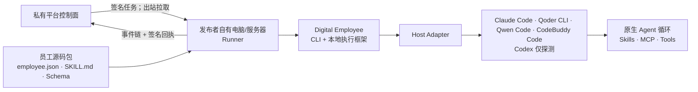

# Digital Employee：Agent-native 数字员工 CLI 与外层运行时

[English](README.md)

**产品方向：**[产品策略](docs/strategy.zh-CN.md) · [路线图](docs/roadmap.zh-CN.md)

Digital Employee 是一套开源的数字员工 CLI、员工包契约和本地执行框架。模型推理、上下文和工具循环由 Claude Code、Qoder CLI、Codex 等 Agent Host 负责；框架负责 Host Adapter、权限策略、包完整性、标准事件和 Runner 执行边界。

当前源码已交付 CLI、可移植员工包、无模型预检、四条版本锁定的 one-shot 上下文/只读 Adapter，以及 V0.3 Runner 技术预览：平台签名任务、确定性包摘要、本机密封快照、租约 fencing、标准事件链和 Runner 签名回执。可部署、卖家自有的 `runner start` 进程、本地持久 replay/outbox 和可重连出站客户端还没有交付；它们属于本开源框架的后续路线。服务端设备注册、任务分发和用量/结算服务属于私有平台。

`answer-agent` 是历史上的首个员工用例：一个默认只读、答案带出处、证据不足就转人工的团队答疑员工。当前仓库中的实现属于 `standalone-v1` 兼容路径。真正 Agent-native 的 recipe 尚未 shipped，交付首个 recipe 属于 M0 路线图。



## 先走通一条实践路径

当前源码已经提供员工包脚手架、静态校验和本机 Agent host 诊断；这些命令不会发起模型调用或产生模型费用：

```bash
npm ci
npm run build
node ./dist/apps/cli/bin.js doctor
node ./dist/apps/cli/bin.js init ../team-answer --author your-team
node ./dist/apps/cli/bin.js validate ../team-answer
node ./dist/apps/cli/bin.js doctor --engine qoder
node ./dist/apps/cli/bin.js doctor --engine claude-code
node ./dist/apps/cli/bin.js doctor --engine qwen-code
node ./dist/apps/cli/bin.js doctor --engine codebuddy
```

然后编辑生成的 `SKILL.md`，把经过批准的资料放入 `knowledge/`，并在 `employee.json` 的 `assets` 中逐个声明要发布的文件；用 `evals/` 固化典型问题。

四条 runnable Adapter 都是无状态、one-shot，要求操作方显式提供服务 API Key/Token，不会复用个人 CLI 登录态。下面的 `run` 会发起真实模型调用，可能消耗所选供应商额度；前面的 `init`、静态 `validate`、`doctor` 不会。以 Qoder 为例：

```bash
export QODER_PERSONAL_ACCESS_TOKEN='...'
node ./dist/apps/cli/bin.js validate ../team-answer --engine qoder
printf '%s\n' '{"message":"批准资料里怎么说？"}' | \
  node ./dist/apps/cli/bin.js run ../team-answer --engine qoder --stdin
```

Claude Code、Qwen Code 或 CodeBuddy 使用同样的 `validate/run` 命令，改为对应 `--engine` 并配置该 Adapter 的服务 API Key 即可。`--stdin`/`--input-file` 让任务数据不进入外层进程参数。Claude Code、Qwen Code 和 CodeBuddy 只接收由 manifest 显式选中、有上限的密封 UTF-8 资产投影，并在空白且隔离的工作目录、HOME 和配置目录中运行；输出被信任前必须确认模型可见 tools 与 MCP 均为空。Claude 还会确认 plugins、Skills 和 slash commands 为空；Qwen 会禁用 slash commands 并锁定不可调用的内建 Agent 目录；CodeBuddy 则会显式拒绝已验证版本的每一个内建工具，因为单独使用空 `--tools` 并不能真正清空工具。Qoder 使用最小只读文件投影，并确认精确的读取/搜索工具集以及空 MCP/Skill/plugin 集；回答文本会等进程与凭证清理成功后再整体按真实服务 Token 脱敏。工具值会在截断前脱敏，包含服务 Token 的工具标识或键会被拒绝，需要凭证或通用模式脱敏的 schema 结构化输出会 fail closed。

四条链路仍是本机/单租户技术预览，不是已经可供市场租赁的在线员工服务；都会 fail-closed 拒绝 MCP、附件、会话恢复、写操作与审批回调。模型认证/推理控制面保持可达，员工 tool/MCP 数据面网络被禁止。当前只完成了一致性 fixture，没有使用真实模型权益验收。

当前 runnable 预览仅支持 POSIX 系统：Adapter 会在发布终态前终止并确认整个进程组退出；Windows 还没有经过验证的 Job Object 等价实现，因此会 fail closed。

员工包规范见 [Portable employee package](docs/employee-package.md)，双运行时决策见 [ADR 0001](docs/decisions/0001-agent-host-boundary.md)。[Agent Host 状态与接入策略](docs/agent-hosts.md)记录了精确边界：Qoder CLI 1.1.x、Claude Code `>=2.1.214 <2.2.0`、Qwen Code `0.17.1` 与 CodeBuddy Code `2.106.4` 的 Adapter 可运行。Codex 仍仅探测：Codex CLI 0.146.0 无法可靠移除每一个模型可见的内建工具，其中包括 `apply_patch`，因此不能满足默认拒绝的工具契约。

| 可运行 Engine | 一致性版本门槛 | 必需的部署配置 |
| --- | --- | --- |
| `qoder` | Qoder CLI 1.1.x | `QODER_PERSONAL_ACCESS_TOKEN` |
| `claude-code` | Claude Code `>=2.1.214 <2.2.0` | `ANTHROPIC_API_KEY` |
| `qwen-code` | Qwen Code `0.17.1` | `OPENAI_API_KEY`、`OPENAI_MODEL` |
| `codebuddy` | CodeBuddy Code `2.106.4` | `CODEBUDDY_API_KEY`、`CODEBUDDY_MODEL` |

## 发布者自有机器上的 Runner 路径

所有应用/服务机器人都必须在发布者或运营者自己的电脑或服务器上运行。私有平台只保存上架身份、包摘要、Quote、租约、事件和结算记录；它不保存员工包本地路径、包内容或 Agent Host 凭证，也不会反向连接用户机器。

V0.3 源码已经提供可嵌入的 one-shot Runner 执行内核和签名续租状态机。一个长期在线 Runner 应当只做出站操作：拉取并认领任务、接收平台签名租约、按身份从本机解析员工包、调用本机 Agent Host、上传 hash-chain 事件和签名回执。平台必须再通过独立 `UsageVerifier` 核验用量，Runner 自报 token 不能直接扣 Credit。

完整接入顺序、伪代码和生产缺口见 [Runner 实践路径](docs/runner.md)，信任边界见 [ADR 0002](docs/decisions/0002-runner-execution-boundary.md)。当前没有对外宣称可直接部署的 `runner start` 网络服务；卖家自有长期进程、本地持久 replay/outbox、断线重连和出站平台客户端仍是开源框架待交付能力。服务端设备注册、任务分发、`UsageVerifier`、Quote、Credit 和结算 API 属于私有平台。

## 版本状态

当前源码是包含上述 Agent-native 命令和 Runner 执行内核的本地 `0.3.0` 发布候选；它**尚未**发布到 npm、GHCR 或 GitHub Releases。在所有发布渠道完成前，请从当前源码运行和集成，不要宣称 `0.3.0` 已可公开安装，也不要覆盖或重新标记 `0.1.0`。

冻结的 `0.1.0` 兼容版本通过三个公开渠道分发：

| 渠道 | 安装或下载方式 |
| --- | --- |
| npm | `npm install --global @fullstack-ai-infra/digital-employee@0.1.0` |
| GHCR | `docker pull ghcr.io/fullstack-ai-infra/digital-employee:0.1.0` |
| GitHub Release | 从 [Releases](https://github.com/fullstack-ai-infra/digital-employee/releases) 下载软件包和校验文件 |

这个版本只有历史答疑运行时；容器默认启动旧 HTTP 演示，不包含 Qoder，也没有新的员工包命令：

```bash
docker run --rm -p 3000:3000 \
  ghcr.io/fullstack-ai-infra/digital-employee:0.1.0
```

当前源码的 `Dockerfile` 只安装已经验证的 npm 候选制品，不会重新从源码树构建，默认只显示帮助。先按[候选制品构建与暂存步骤](docs/distribution.md)准备同一个 tarball；只有明确测试兼容运行时时才进入 `legacy`：

```bash
docker build -t digital-employee:candidate .
docker run --rm digital-employee:candidate
docker run --rm -p 3000:3000 digital-employee:candidate \
  legacy serve --config ./dist/configs/demo.json --host 0.0.0.0 --port 3000
```

## 不是只开源一个机器人，也不是再造一个 Agent

`answer-agent` 是历史员工用例，不是当前源码已经 shipped 的 Agent-native recipe，也不是整个产品。员工包负责定义：

- 它是谁、服务什么领域；
- 可以读取哪些知识和调用哪些 MCP 能力；
- 对 Agent host 有哪些强制能力要求；
- 哪些目录只读，哪些操作必须审批；
- 没把握时交给谁。

同一个员工包后续可以投影到不同 Agent host；同一个外层运行时也可以承载项目助理、运营员工等岗位，而不需要复制消息、记忆、权限和审计代码。

Agent-native 新路径使用 `employee-package.v1alpha1`；其中 `SKILL.md` 是角色和工作流真源，JSON Schema 是输入输出契约，MCP 是文档、网盘、DWS 等外部能力的通用接口。`AGENTS.md`、Claude/Qoder 配置和启动参数只是 Host Adapter 生成的投影。

原 `employee-profile.v1` 继续服务 `standalone-v1` 兼容路径。契约与迁移方式见 [Profile manifest 说明](docs/profile-manifest.md)。

## 五分钟跑通 `standalone-v1` 演示

需要 Node.js 20 或更高版本。默认演示只读取仓库里的公开示例资料，不需要模型密钥、钉钉应用或 DWS 登录。

```bash
git clone https://github.com/fullstack-ai-infra/digital-employee.git
cd digital-employee
npm install
npm run legacy:demo -- --question "What should I include in an incident report?"
```

它会从批准的示例手册中提取相关段落，并附带来源：

```text
Based on the approved source “Example team handbook”:

## Incident reports
Include the application version, sanitized command, complete error category,
and the time window...

Sources:
- Example team handbook: source://demo-handbook/handbook.md
```

再问一个需要实际执行的请求：

```bash
npm run legacy:demo -- --question "Approve a production deployment for me."
```

只读岗位不会假装已经操作：

```text
I could not find enough approved evidence. Please ask a maintainer.

Human review: human-support (model_requested)
```

## `standalone-v1` 的四种入口

权威入口统一放在 `digital-employee legacy ...` / `npm run legacy:*` 下。旧的顶层 `ask`、`sync`、`start`、`serve` 在 `0.x` 仅作为带警告的兼容别名保留；Agent-native 的 `run` 不会在 Host 失败时自动回退到这里。

单次问答：

```bash
npm run legacy:ask -- --config ./configs/demo.json --question "..."
```

交互式命令行：

```bash
npm run legacy:start -- --config ./configs/demo.json
```

本地 HTTP：

```bash
npm run legacy:serve -- --config ./configs/demo.json --port 3000
```

内置 HTTP 入口默认无状态，并拒绝客户端自选 `requestId`、`actorId` 和 `sessionId`，避免共享 Bearer Token 的调用方串到其他人的会话历史。需要多轮 HTTP 会话时，应先在核心前增加按用户认证的网关。

钉钉 Stream：

```bash
cp configs/dingtalk-dws.example.json configs/local.json
export DINGTALK_CLIENT_ID='...'
export DINGTALK_CLIENT_SECRET='...'
export OPENAI_API_KEY='...'
npm run legacy:start -- --config ./configs/local.json --channel dingtalk
```

钉钉适配器会先把用户与会话标识哈希化，再交给通用运行时。默认日志不输出问题正文、用户 ID 和会话 Webhook。

## DWS：数字员工连接钉钉工作空间的能力层

在 Agent-native 路径中，DWS 应作为受权限控制的 MCP/能力层；在现有 `standalone-v1` 中，答疑岗位通过只读 source connector 读取经过批准的：

- 钉钉文档；
- AI 听记摘要与转写；
- 指定群、指定时间范围内的聊天记录；
- Wiki 空间和节点；
- 钉盘文件元数据。

DWS 连接器要求显式 `profile` 和逐条 `approvedQueries`。它不会自动选择账号、扫描整个组织、自动翻页或跟随搜索结果读取更多对象。详细边界见 [DWS 连接器文档](docs/connectors/dws.md)。

DWS 的安装、授权和完整能力请查看
[DingTalk Workspace CLI 开源仓库](https://github.com/DingTalk-Real-AI/dingtalk-workspace-cli)。

## 当前能力

| 能力 | 状态 |
| --- | --- |
| `employee-package.v1alpha1`、`agent-host.v1` 与能力协商 | 已交付（源码分支） |
| `init`、静态 `validate`、本机 `doctor` | 已交付（源码分支） |
| Qoder CLI 1.1.x 无状态只读 `run --engine qoder` Adapter | 已交付（源码分支）；未使用真实模型权益验收 |
| Claude Code `>=2.1.214 <2.2.0`、Qwen Code `0.17.1`、CodeBuddy Code `2.106.4` 上下文 Adapter | 已交付（源码分支）；未使用真实模型权益验收 |
| 签名任务、包摘要、本机快照、租约 fencing、事件链、Runner 签名回执 | 已交付（V0.3 源码技术预览） |
| 卖家自有长期 Runner 进程、本地持久 replay/outbox 和重连 | 尚未交付；属于开源框架路线 |
| 服务端设备注册、任务分发、用量核验、Quote/Credit 和结算 | 私有平台；不进入本框架仓库 |
| Agent-native `service start`（通道、队列、审计、长期在线） | 尚未交付；下一阶段 |
| Codex CLI 运行 Adapter | 仅探测；受阻于无法可靠移除所有模型可见内建工具 |
| `standalone-v1` 岗位及渠道、知识源、模型、工具 registry | 已交付；兼容路径 |
| 只读 `answer-agent` 岗位 | 已交付 |
| Console 与 HTTP 入口 | 已交付 |
| 钉钉 Stream 入口 | 已交付；真实应用凭证集成验证需要单独环境 |
| 文件、Git、DWS 知识源 | 已交付 |
| 引用、人工接力、仅确认反馈后学习 FAQ | 已交付 |
| 项目助理、运营员工等员工包 | 规划中 |
| 写工具与审批流 | 规划中；首版禁用 |
| 市场、定价、可信用量与结算 | 独立私有平台；不进入本框架仓库 |

## 安全默认值

- `answer-agent` 默认只读。
- 不发现知识源，不做全账号采集。
- DWS 命令和参数均使用只读白名单，并强制 JSON 输出。
- `answer-agent` 的回答如果没有解析到批准来源中的有效引用，会直接转人工。
- 模型请求、DWS 子进程和钉钉回复都有超时及大小限制。
- OpenAI-compatible 地址默认拒绝字面量和 DNS 解析后的私网地址，只有显式开启 `allowPrivateNetwork` 才能使用。
- 钉钉会话 Webhook 只接受官方 HTTPS 域名。
- 会话记忆有 TTL 和容量上限。
- FAQ 只有在反馈被明确标记为已验证后才会学习。
- 结构化错误自动清理凭证字段，不返回调用栈。

接入私有知识或新增工具前，请先阅读 [SECURITY.md](SECURITY.md) 和 [架构说明](docs/architecture.md)。[验证账本](docs/verification.md) 会明确区分自动化测试、容器实测、DWS 真实读取以及尚未完成的真实凭证验证。

## 与 `design-system`、平台和 `mem` 的关系

`design-system` 只是未来管理页面可复用的 UI 资产，不是 `digital-employee` 的运行时。机器人上架、租赁、动态价格、可信计量、评价和分账属于独立的私有平台；本仓库只负责“员工能被一致构建、校验，并在发布者机器上安全运行”。平台不能导入或托管 Agent Host 执行代码。

[`mem`](https://github.com/fullstack-ai-infra/mem) 可以作为后续可选的长期记忆与检索能力，本项目不重复建设 memory plane。

在 Agent-native 路径中，`mem` 应位于经过批准的扩展边界之后；`standalone-v1` 只为兼容保留历史答疑编排、引用、反馈和人工接力能力，不能据此把答疑流程重新定义为整个 Digital Employee 的核心。

## 开发

```bash
npm ci
npm run typecheck
npm run build
npm run check
npm audit --omit=dev --audit-level=high
```

应用、运行时包、连接器、岗位配置与测试均以 TypeScript 作为唯一源码。
`npm run build` 会在 `dist/` 生成可执行 ESM、类型声明、source map 和公开
demo 资源；npm 包导出和 CLI 只执行这些编译产物。`scripts/` 目录中的
JavaScript 仅用于构建、安全与发布自动化，不在运行时 import 链路中。

贡献方式见 [CONTRIBUTING.md](CONTRIBUTING.md)。项目采用 [Apache-2.0](LICENSE) 许可证。
